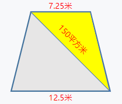

## 表达式计算

接下来我们来了解一些常用的算术运算符的语法形式:

> 假设变量 a 的值为 20，变量 b 的值为 10，则：

| 运算符 | 描述 | 结果 | 运算顺序 |
| --- | --- | --- | --- |
| + | 操作数a加操作数b | a + b => 30 | L → R |
| - | 操作数a减操作数b | a - b => 10  | L → R |
| * | 操作数a乘操作数b | a * b => 200  | L → R |
| / | 操作数a除以操作数b | a / b => 2  | L → R |
| % | 操作数a对操作数b取余 | a % b => 0 | L → R |


### 计算题

了解完常用的算术运算符后，我们做一些程序题来掌握它们的使用方式

#### 计算 9x9

> 问题描述: 输出 9x9的结果。

> 样例输出:
> ```console
> 9 x 9 = 81
> ```


`main` 函数内部是以下代码：

```cpp
    int mul = 9 * 9; // 乘法在c++中 用 星号(*)表示
    cout << "9 x 9 = " << mul << endl; // 按照格式输出,不要遗漏空格
    return 0; // 返回函数结果 0
```

上述代码实现了 9x9 的计算。这里有几个细节和知识点需要记住。

首先，这里通过 `int mul` 定义了一个整型变量 *mul*, 用来存储 9x9 的计算结果。

其次，输出的时候, 一定要注意空格问题, 不要遗漏空格。

#### A + B 问题

> 问题描述: 给定两个整数 A 和 B，输出 A + B 的值。

> 样例输入:
> ```console
> 1 6
> ```

> 样例输出:
> ```console
> 1 + 6 = 7
> ```


`main` 函数内部是以下代码：

```cpp
    int a, b; // 定义整型变量 a ,b
    cin >> a >> b; // 写入输入值
    cout << a << " + "<< b << " = " << (a + b) << endl; // 按照格式输出,不要遗漏空格
    return 0; // 返回函数结果 0
```

#### (A + B) * C 问题

> 问题描述: 给定三个整数 A, B 和 C，输出 (A + B) * C 的值。

> 样例输入:
> ```console
> 2 3 5
> ```

> 样例输出:
> ```console
> (2 + 3) * 5 = 25
> ```


`main` 函数内部是以下代码：

```cpp
    int a, b, c; // 定义整型变量 a ,b, c
    cin >> a >> b >> c; // 写入输入值
    cout << "("<< a << " + ";
    cout << b << ") * ";
    cout << c << " = " << ((a + b) * c) << endl; // 按照格式输出,不要遗漏空格
    return 0; // 返回函数结果 0
```

#### 带余数的除法

> 问题描述: 给定 被除数a, 除数b(非零)，输出 商和余数。

> 样例输入:
> ```console
> 5 3
> ```

> 样例输出:
> ```console
> 商: 1, 余数: 2
> ```


`main` 函数内部是以下代码：

```cpp
    int a, b; // 定义整型变量 a ,b
    cin >> a >> b; // 写入输入值
    cout << "商: ";
    cout << (a / b);
    cout << ", 余数: ";
    cout << (a % b);
    return 0; // 返回函数结果 0
```

上述代码实现了 商和余数 的计算。这里有几个细节需要记住。

首先, 在Windows平台下可能会输出乱码。这是因为 windows下的默认编码格式 GBK, 而我们的编译文件的编码格式是 UTG-8。可以通过以下方式解决:

```console
$ g++ main.cpp -o main.exe -fexec-charset=GBK -finput-charset=UTF-8 

```

其中, 编译指令 `-fexec-charset=GBK` 指定采用编码格式 `GBK` 编译可执行文件, `-finput-charset=UTF-8` 指定采用编码格式 `UTF-8` 读取源文件 *main.cpp*。


#### 草场面积

> 问题描述: 已知梯形草场中黄色部分面积为150平方米, 求草场面积。



> 样例输出:
> ```console
> 草场面积: xxx
> ```

> 题目分析:
> 1) 三角形面积公式: S= (底 x 高)/2
> 2) 梯形由两个三角形拼接而成
> 3) 两个三角形高度相同
> 4) 梯形面积 = 三角形A面积 + 三角形B面积

`main` 函数内部是以下代码：


```cpp
    double h; // 定义浮点型变量 h 表示高度
    double la = 7.25; // 定义浮点型变量 la 表示三角形A的底边
    double lb = 12.5; // 定义浮点型变量 lb 表示三角形B的底边
    h = 2 * 150 / la;
    double s = 150 + (lb * h / 2); // 计算梯形面积
    cout << "草场面积:" << s <<endl;
    return 0; // 返回函数结果 0
```
上述代码实现了 梯形草场的面积计算。这里有几个细节需要记住。

首先, 对于带小数的数字，我们使用关键字 `double` 定义, 表明声明的变量是一个浮点型。

其次, 表达式中的运算符运算是带有优先级的, 比如 乘除法的优先级就高于加减法。要想改变优先级顺序，可以通过给表达式套上小括号 `(表达式)`。比如 `(1 + 2) * 2` 会优先计算括号内的表达式。